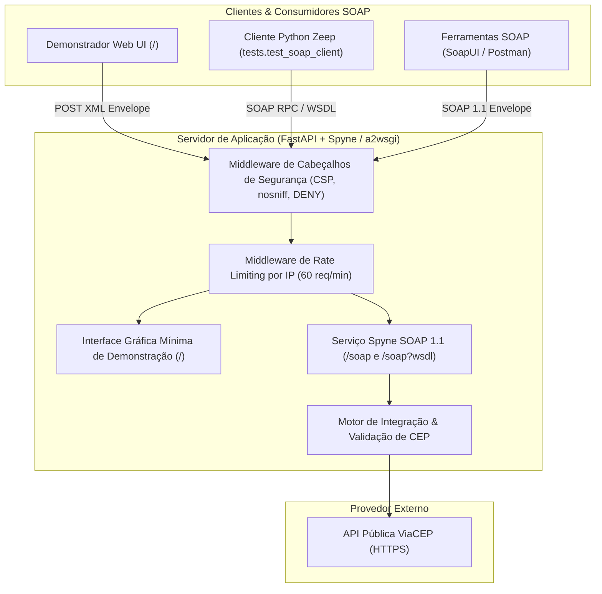

# ⚡ Servidor SOAP 1.1 de Consulta de CEP

[](https://python.org)
[](https://fastapi.tiangolo.com)
[]()
[-brightgreen)]()
[]()

Aplicação servidora desenvolvida em **Python 3.11** para atendimento dos requisitos de Arquitetura e Integração de APIs. A solução implementa um serviço nativo **SOAP 1.1** com geração dinâmica de contrato **WSDL** e interface gráfica mínima para demonstração em tempo real, integrado ao provedor de dados públicos **ViaCEP**.

---

## 📐 Arquitetura da Solução



---

## 📁 Estrutura de Diretórios do Projeto

```
api-soap/
├── .env.example                  # Modelo de variáveis de ambiente do projeto
├── pyproject.toml                # Metadados, dependências e configurações de testes
├── README.md                     # Documentação principal da aplicação
├── src/                          # Código-fonte da aplicação
│   ├── __init__.py
│   ├── main.py                   # Ponto de entrada FastAPI, montagem Spyne e inicialização Uvicorn
│   ├── core/                     # Módulos centrais de infraestrutura
│   │   ├── __init__.py
│   │   ├── config.py             # Configurações globais e variáveis operacionais
│   │   └── security.py           # Rate Limiting por IP, sanitização e cabeçalhos de segurança
│   ├── services/                 # Regras de negócio e serviços SOAP
│   │   ├── __init__.py
│   │   ├── soap_service.py       # Definição RPC do Spyne, modelos ComplexType e WSDL
│   │   └── viacep_client.py      # Cliente HTTP de comunicação com o ViaCEP
│   └── views/                    # Camada de apresentação
│       ├── __init__.py
│       └── web_ui.py             # Interface Gráfica mínima de demonstração SOAP (HTML/CSS/JS)
└── tests/                        # Suíte de testes automatizados
    ├── __init__.py
    ├── conftest.py               # Fixtures globais do Pytest
    ├── test_soap_client.py       # Execução direta de testes do cliente SOAP Zeep
    ├── unit/                     # Testes unitários (100% isolados com Mocks)
    │   ├── test_security.py      # Testes de rate limiter e sanitização de inputs
    │   └── test_viacep_client.py # Testes de validação, formatação e requisições HTTP
    ├── integration/              # Testes de integração
    │   └── test_soap_service.py  # Testes dos métodos RPC, endpoints e middlewares
    ├── contract/                 # Testes de contrato WSDL
    │   └── test_wsdl_contract.py # Validação de schema XML, operações e envelopes SOAP
    └── e2e/                      # Testes End-to-End
        └── test_soap_client.py   # Testes automatizados com cliente Zeep
```

---

## 🛠️ Tecnologias Utilizadas

- **Linguagem**: Python 3.11 com gerenciador de ambiente e dependências **`uv`**
- **Framework SOAP**: **Spyne 2.14** (RPC nativo, modelos XML tipados e contrato WSDL 1.1)
- **Engine Web & ASGI**: **FastAPI** + **a2wsgi** + **Uvicorn**
- **Cliente SOAP**: **Zeep 4.2**
- **Testes & Qualidade**: **Pytest 9.1**, **pytest-cov** (99% de cobertura) e **pytest-mock**

---

## 🚀 Como Executar o Projeto

### 1. Pré-requisitos e Instalação de Dependências

Certifique-se de ter o `uv` instalado. Em seguida, sincronize o ambiente virtual:

```bash
uv sync
```

### 2. Inicialização do Servidor SOAP

Execute o servidor local na porta `8000`:

```bash
uv run python -m src.main
```

O servidor estará disponível nos seguintes endereços:
- **Interface Gráfica de Demonstração**: [http://localhost:8000/](http://localhost:8000/)
- **Endpoint SOAP 1.1**: `http://localhost:8000/soap`
- **Contrato WSDL**: [http://localhost:8000/soap?wsdl](http://localhost:8000/soap?wsdl)
- **Health Check**: [http://localhost:8000/health](http://localhost:8000/health)

---

## 🖥️ Interface Gráfica Mínima de Demonstração

A aplicação disponibiliza na rota raiz `/` uma interface gráfica moderna e minimalista que interage diretamente com o endpoint SOAP via requisições HTTP POST com envelopes XML:

1. **Consultar CEP (`consultar_cep`)**: Permite inserir um CEP ou selecionar exemplos rápidos (ex: `01001-000`, `90010-270`), executando a chamada RPC SOAP e exibindo os dados do endereço juntamente com o envelope XML de requisição e resposta.
2. **Validar CEP (`validar_cep`)**: Valida o padrão numérico de 8 dígitos de um CEP via SOAP.
3. **Buscar por Logradouro (`buscar_por_logradouro`)**: Pesquisa endereços por Estado (UF), Cidade e Rua via SOAP RPC Array response.
4. **Testador Raw XML**: Permite carregar templates SOAP prontos ou escrever envelopes XML arbitrários e inspecionar a resposta bruta do servidor SOAP.

---

## 📜 Operações do Contrato WSDL (SOAP 1.1)

O contrato WSDL gerado pelo Spyne expõe 4 operações RPC no namespace `api.soap.cep`:

| Operação RPC | Parâmetros de Entrada | Tipo de Retorno | Descrição |
| :--- | :--- | :--- | :--- |
| `consultar_cep` | `cep` (string) | `EnderecoResponse` | Consulta endereço completo no ViaCEP por CEP |
| `validar_cep` | `cep` (string) | `ResultadoValidacao` | Valida conformidade do formato de 8 dígitos do CEP |
| `buscar_por_logradouro` | `uf` (string), `cidade` (string), `logradouro` (string) | `Array(EnderecoResponse)` | Retorna lista de endereços correspondentes aos filtros |
| `obter_status_servico` | *Nenhum* | `StatusServicoResponse` | Retorna status de integridade e metadados operacionais |

---

## 📨 Exemplo de Envelope SOAP 1.1 (Requisição e Resposta)

### Requisição HTTP POST para `/soap`

```http
POST /soap HTTP/1.1
Host: localhost:8000
Content-Type: text/xml; charset=utf-8
SOAPAction: consultar_cep

<?xml version="1.0" encoding="UTF-8"?>
<soapenv:Envelope xmlns:soapenv="http://schemas.xmlsoap.org/soap/envelope/" xmlns:spy="api.soap.cep">
   <soapenv:Header/>
   <soapenv:Body>
      <spy:consultar_cep>
         <spy:cep>01001-000</spy:cep>
      </spy:consultar_cep>
   </soapenv:Body>
</soapenv:Envelope>
```

### Resposta SOAP 1.1 Retornada

```xml
<soap11env:Envelope xmlns:soap11env="http://schemas.xmlsoap.org/soap/envelope/" xmlns:tns="api.soap.cep">
   <soap11env:Body>
      <tns:consultar_cepResponse>
         <tns:consultar_cepResult>
            <tns:cep>01001-000</tns:cep>
            <tns:logradouro>Praça da Sé</tns:logradouro>
            <tns:complemento>lado ímpar</tns:complemento>
            <tns:bairro>Sé</tns:bairro>
            <tns:localidade>São Paulo</tns:localidade>
            <tns:uf>SP</tns:uf>
            <tns:ibge>3550308</tns:ibge>
            <tns:gia>1004</tns:gia>
            <tns:ddd>11</tns:ddd>
            <tns:siafi>7107</tns:siafi>
            <tns:sucesso>true</tns:sucesso>
            <tns:mensagem>CEP encontrado com sucesso.</tns:mensagem>
         </tns:consultar_cepResult>
      </tns:consultar_cepResponse>
   </soap11env:Body>
</soap11env:Envelope>
```

---

## 🧪 Suíte de Testes Automatizados

### Execução de Todos os Testes com Relatório de Cobertura

```bash
uv run pytest
```

### Execução dos Testes do Cliente Zeep (com o servidor rodando)

```bash
uv run python -m tests.test_soap_client
```

---

## 🔒 Medidas de Segurança Implementadas

1. **Rate Limiting por IP**: Limita o tráfego a 60 requisições por minuto por IP com headers informativos (`X-RateLimit-Limit`, `X-RateLimit-Remaining`, `X-RateLimit-Reset` e `Retry-After`).
2. **Cabeçalhos de Segurança HTTP**: Proteção contra ataques web (`X-Content-Type-Options: nosniff`, `X-Frame-Options: DENY`, `X-XSS-Protection: 1; mode=block`, `Referrer-Policy: strict-origin-when-cross-origin`).
3. **Sanitização de Inputs**: Filtragem rigorosa de caracteres de injeção XML/XSS antes do processamento RPC.
